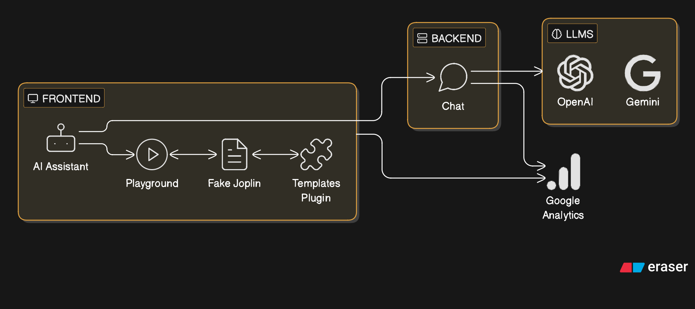

Joplin Templates Assistant (Albus) is an AI powered assitant for writing powerful and dynamic templates for the Joplin note taking app. This assistant can also answer any plugin specific queries (e.g. "How to set default templates for a specific notebook?").

This app also has a playground editor to make edits to generated templates and test how would they work in the actual Joplin app.

This app uses the real [template-plugin](https://github.com/joplin/plugin-templates) to run your templates. The plugin interacts with a [fake joplin environment](./fake-joplin/) that runs inside the app itself.

> [!NOTE]
> The fake joplin environment is not a generic replica of the actual joplin app. It's built very specific to how templates-plugin interacts with the Joplin Plugin API.

## Why?
`v3.0.0` release of joplin templates plugin introduces support for very powerful features like conditions, loops, math helpers, datetime modifiers, etc.

However it may be a little time & mental bandwidth consuming to learn & use these new features.

With the advent of LLMs, this app aims to make it easier for the end-users to create & use dynamic joplin templates. 

## Architecture

## Telemetery

> [!NOTE]
> The content of the templates that you run is not stored anywhere as such. However, your queries to the AI assistant are sent to LLM models.

This app uses [Google Analytics](https://analytics.google.com/) to collect some generic site usage data, along with some specific metrics that can be used to answer things like
- How many successfully executed v/s failed to execute?
- What llm models / providers are most upvoted by the users?
- What llm models / providers timeout the most?
- What llm models / providers fail to generate a response?

## Issues
Please feel free to open a GitHub issue in this repository to file any bugs / feature requests for this app.

But please use the [templates-plugin issue tracker](https://github.com/joplin/plugin-templates) for any bugs / feature requests related to the plugin.

## Sponsor
This assistant and the templates-plugin are built by [Nishant Mittal](https://nishantwrp.com). Your support helps cover LLM costs and future development!

You can sponsor via [GitHub Sponsors](https://github.com/sponsors/nishantwrp), [PayPal](https://www.paypal.com/paypalme/nishantwrp) or [BuyMeACoffee](https://buymeacoffee.com/nishantwrp).

## Credits
This app was mostly vibe-coded via [Gemini CLI](https://geminicli.com) in a weekend. Thanks Google for the generous free tier.

Also, thanks [eraser.io](https://eraser.io) for the architecture diagram.
